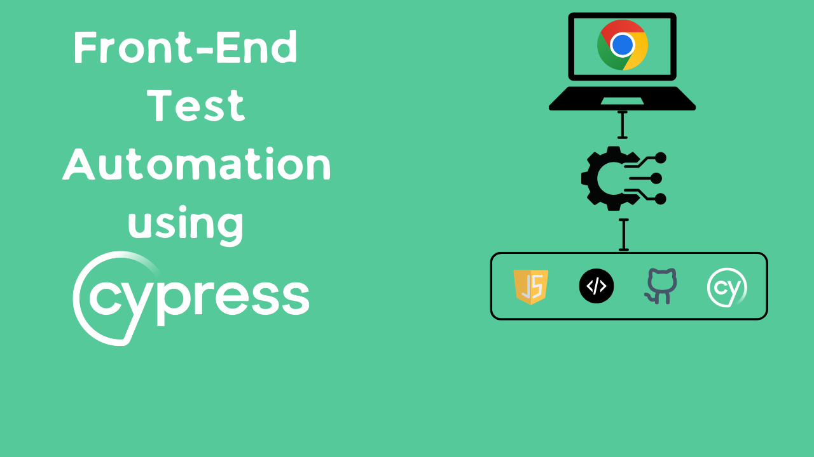
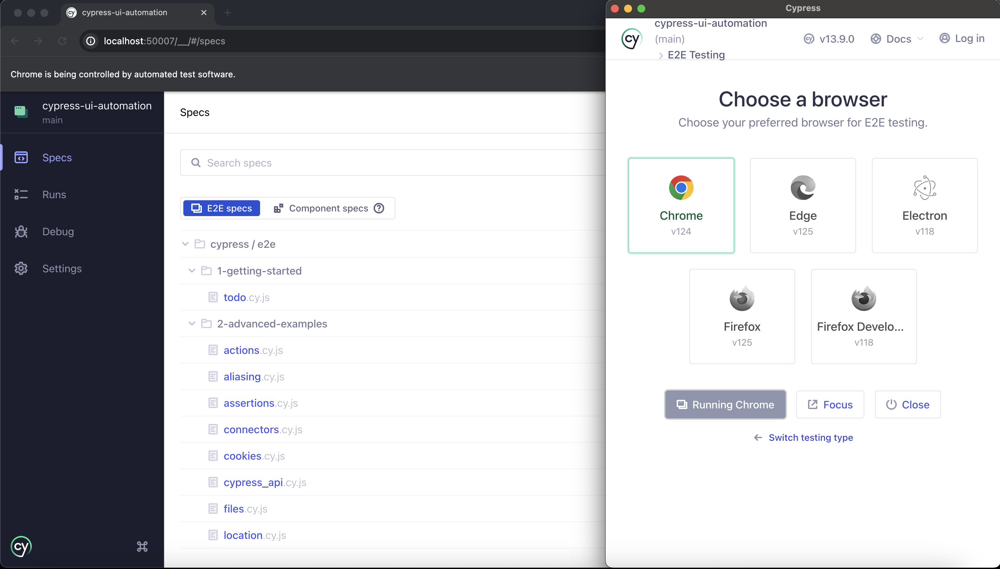
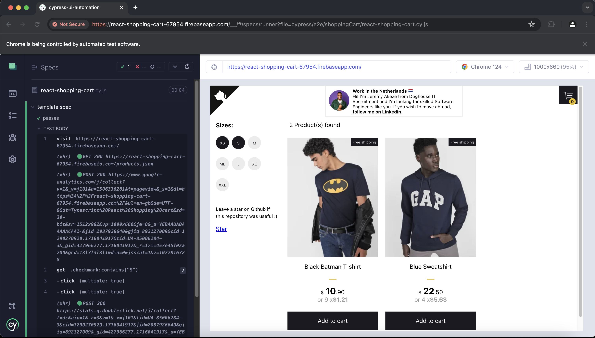
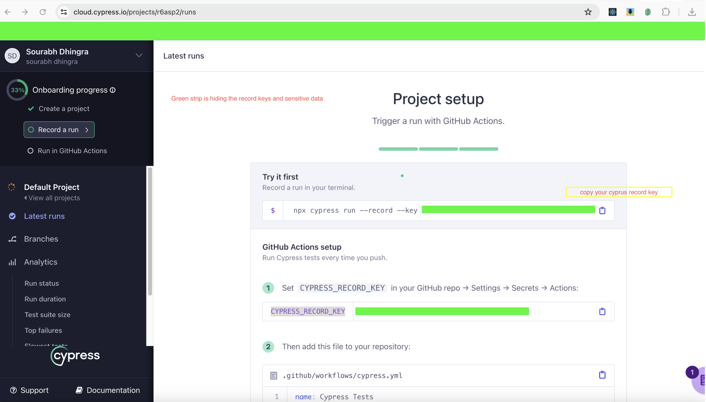
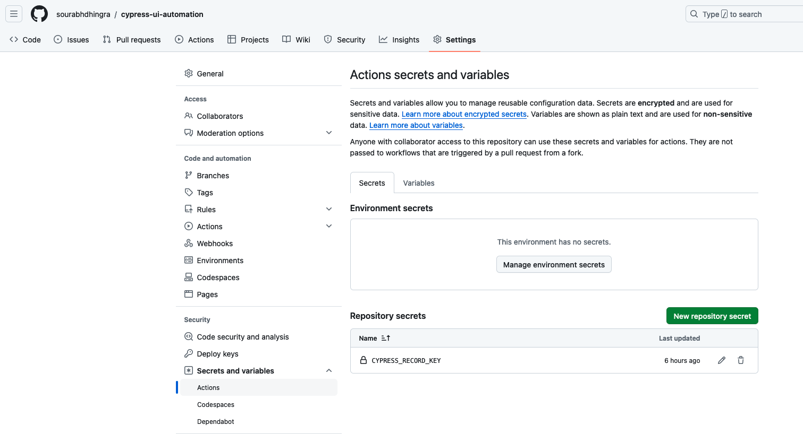
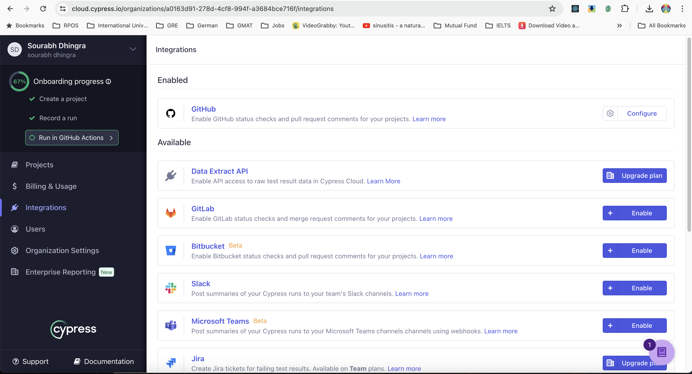
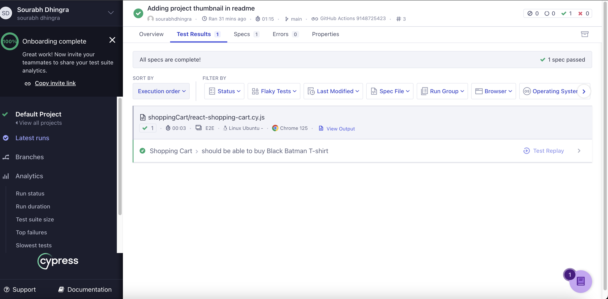
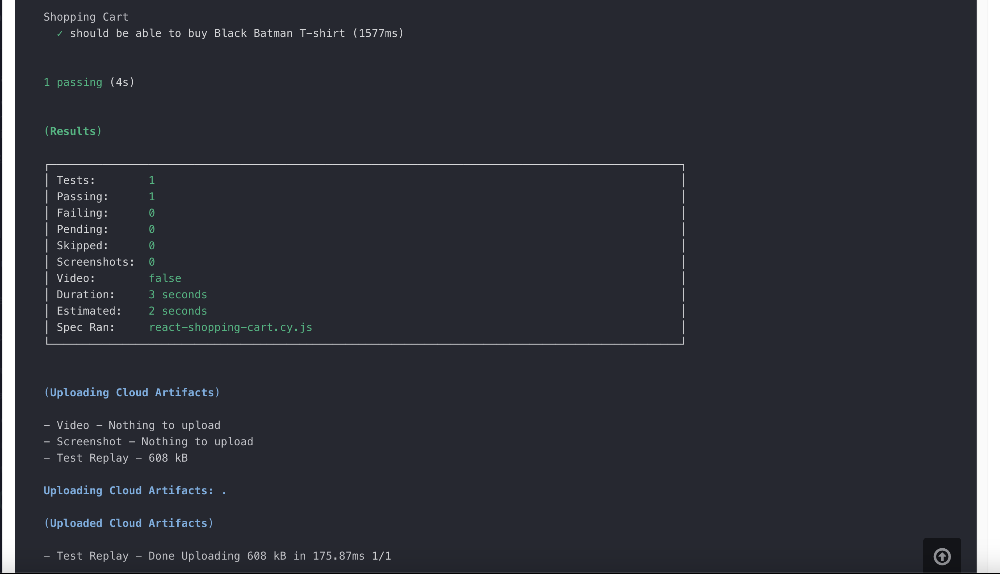

### Front-End Automation using Cypress

[Cypress](https://docs.cypress.io/guides/overview/why-cypress) is a next generation front end testing tool built for the modern web. This project will showcase how to use Cypress for writing UI automation test cases.
- Website to showcase Cypress test automation (https://react-shopping-cart-67954.firebaseapp.com/). Credits to [Jefferson Riberio](https://github.com/jeffersonRibeiro) who is the creator of website. 
- Cypress will be used to write test cases for the demo websites.

1. Install cypress `npm install cypress --save` and not as dev dependency.
2. Run `npx cypress open`. Below window should open!
    
3. From the window > choose Chrome > Start E2E Testing in Chrome.
4. Cypress will open a new Chrome browser and run the test cases. Below is the screenshot of the test cases running. From this window either add your own spec or use existing examples!
     
5. While manually creating your spec make sure your file follows format `*.cy.js`
6. Select your spec `react-shopping-cart.cy.js` in this case.Selecting a spec will load the test run.
7. Cypress will run the test cases and show the results. Below is the screenshot of the test cases running.
    
8. Setting up CI for Cypress requires setting up of a server process of `Cypress run` since in CI container a Cyprus server need to start. You can set your application server locally and then ensure it works for CI too. Use [start-server-and-test](https://www.npmjs.com/package/start-server-and-test) npm package.
    ```
    npm install start-server-and-test --save-dev
    ```

9. Now update `script` section in `package.json` with below. `my-server` refers to your application server which is found in `PATH` and can be run locally or on CI container.
    ```json
     "scripts": {
        "start": "my-server -p 3000",
        "cy:run": "cypress run",
        "test": "start-server-and-test start http://localhost:3000 cy:run"
    }
    ```

10. In this project we do not need above step as we are testing on an already deployed website.

11. [Cypress Cloud](https://www.cypress.io/cloud) rightly says:
    >Cypress Cloud unlocks the full potential of Cypress test automation tools in your CI pipeline. Scale every facet of Cypress testing, and push your code with confidence every time.

12. Cyprus cloud provides Test Replay features and close integration with CI proivder such as Gitlab/   Github

13. Account needs to be created in Cypress cloud through which you can integrate Github too. Cyprus cloud will generate a `CYPRUS_RECORD_KEY` through will test runs will be recorded. Github workflow needs to explicity specify the usage of this key.


14. Additionally `CYPRUS_RECORD_KEY` needs to be set up as an Action secret for the in-use github repo. Go to Repository > Settings > Secrets and Variables > Actions and add `CYPRUS_RECORD_KEY` as secret.


15. Also enable github integration with Cypress Cloud as it will keep test details in Sync.


16. Once pipeline is set up successfully, each test execution in CI can also be analysed in Cypress Cloud.


17. Notice the details such as name of spec run, time taken, container: Linux Ubuntu, Browser: Chrome 125 etc. Cyprus cloud provides quite a comprehensive reporting along with Test Replay. We can also enable the screenshots and video recording as they are disabled by default. In such scenario only cloud artifact uploaded are logs. Click arrow button right to `Test Replay` then click on `View Ouput`. You would see below:


18. A little about Cypruss code Cypress offers amazing capablities in form [Cypress commands(https://docs.cypress.io/api/table-of-contents)] viz.
    - `query` - Queries are Cypress commands that read the state of your application. They return a subject for further commands to act or assert on, and retry as needed to make sure the DOM element or other data they yield is always up to date.
    - `assertion` - Cypress commands that assert on the state of your application. They pause your test until the given condition is met, or until they time out
    - `action` - Actions are Cypress commands that interact with your application as a user would. They wait for elements to be actionable before interacting with the page.
    - `other` - Cypress has a variety of additional commands to help write tests for e.g. taking screenshots, clearing cookies or session storage, pause a test execution etc.

    These set of commands make it highly feasible and easy to write automation test steps. Will explain next.

19. Let us take below code snippet.
    ```javascript
    cy.get('span').contains('Cart').should('be.visible')
    ```
    - Here `cy` is short for cypress. 
    - `get` is to query the DOM that can result in one or more elements depending upon the selector passed.
    - `contains` is another query commans which would operate on the element returned by `get`. It checks if the text of elements contains the substring input passed.
    - `should` is an assertion. Cypress supports Awesome `Chai`, `Sinon-Chai` and `Chai-jquery` making it really powerful and readable code. Checkout [link](https://docs.cypress.io/guides/references/assertions)
    - We have used `should` an assertion passing it `chainers` i.e `'be.visible'` which checks if the element is yet visible in the DOM or not.
    - Beauty here is the chainable commands. We can chain commands one after another pefrom a combination of query, assertion, action etc. This helps reduce the line of code.
