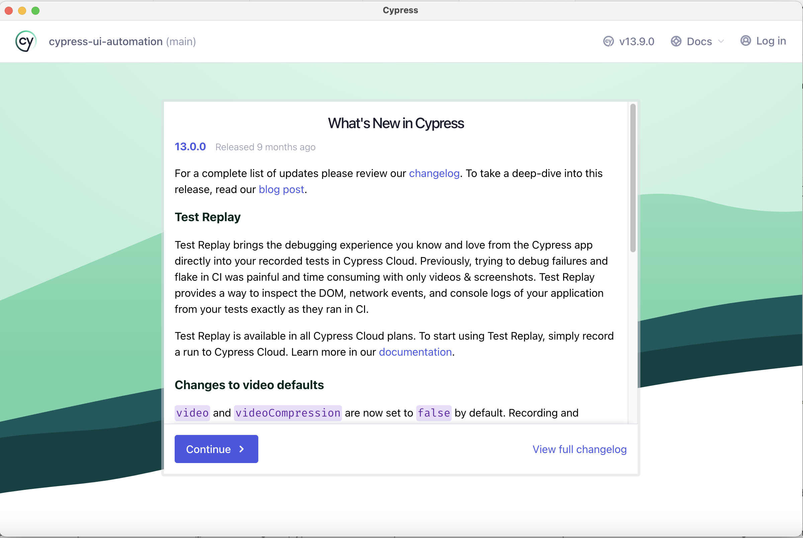

### Front-End Automation using Cypress

[Cypress](https://docs.cypress.io/guides/overview/why-cypress) is a next generation front end testing tool built for the modern web. This project will showcase how to use Cypress for writing UI automation test cases.
- Website to showcase Cypress test automation (https://react-shopping-cart-67954.firebaseapp.com/). Thanks to [Jefferson Riberio](https://github.com/jeffersonRibeiro) who works at [Mendix](https://www.mendix.com)
- Cypress will be used to write test cases for the demo websites.

1. Install cypress `npm install cypress --save` and not as dev dependency.
2. Run `npx cypress open`. Below window should open!
    
3. Click on `e2e` folder and click on `index.js` file. Cypress will run the test cases and show the results in